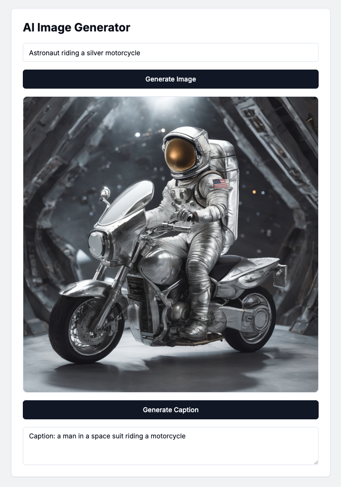

## About

This is a simple NextJS app that uses Replicate to generate images from a prompt, as well as to generate caption from the image; so we can compare the prompt with the caption.

Once an image is generated, it is saved in Pocketbase.

## Screenshot

## Stack

- NextJS
- Replicate
- Shadcn/UI
- Pocketbase

## Getting Started

- Install NextJS
- Signup at Replicate and get your API key
- Put API key in `.env.local` file
- Install Pocketbase and run it locally
- Setup a collection in Pocketbase named `generated_images` with the following fields:
  - `prompt`: Text
  - `image_url`: URL
- Put Pocketbase URL in `.env.local` file (usually `http://127.0.0.1:8090`)

## Start the app

- go to the project directory
- > ./pocketbase serve
- > npm run dev
- Open [http://localhost:3000](http://localhost:3000) with your browser to see the result.

## Notes

- Currently this should only run locally. If it's hosted, then might wanna add additional code such as authentication -- as anyone can generate images under the Replicate API key.
